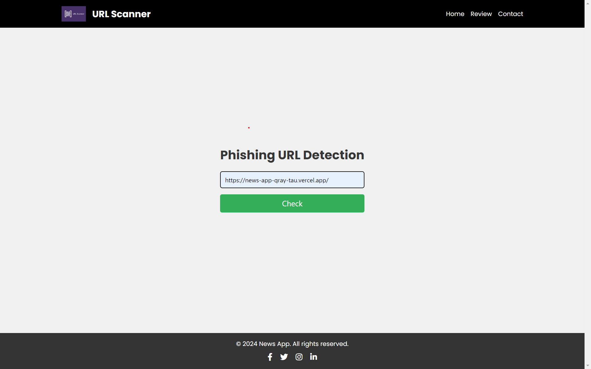
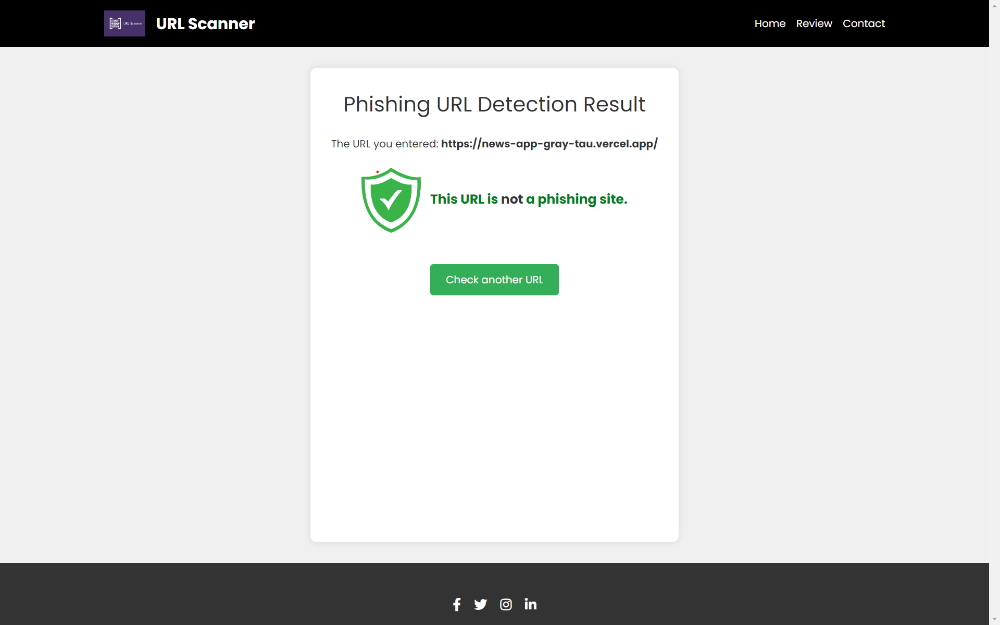

# Phishing Website Detector

## Introduction

The Phishing Website Detector is an advanced machine learning project designed to identify and classify phishing websites using URL-based features. In an era where cyber threats are increasingly sophisticated, this tool serves as a crucial line of defense against phishing attacks, which remain one of the most prevalent forms of cybercrime.

## Project Overview

Phishing attacks often rely on creating URLs and websites that closely mimic legitimate ones. This project leverages machine learning techniques, specifically the XGBoost algorithm, to analyze various features of URLs and determine the likelihood of them being phishing attempts.

### Key Objectives:

1. Extract and analyze relevant features from URLs

2. Develop a robust machine learning model for classification

3. Provide an accurate and efficient tool for phishing detection

## WebPages

### Home Page


### Result page


### Review page


## Features Extracted

The system extracts 16 key features from each URL, which serve as inputs for the machine learning model:

1. Presence of IP address in domain

2. URL length

3. Presence of '@' symbol

4. Depth of URL

5. Redirection using '//'

6. Presence of 'https' in domain part

7. Use of URL shortening services

8. Presence of '-' in domain name

9. DNS record

10. Website traffic

11. Age of domain

12. End period of domain

13. iFrame redirection

14. Mouse over changes

15. Right click disabled

16. Website forwarding

## Dataset

The dataset used for this project consists of 10,000 URLs:

- 5,000 phishing URLs

- 5,000 legitimate URLs

This balanced dataset ensures that the model learns to distinguish between phishing and legitimate URLs effectively.

## Model Development

### Algorithm Choice

We chose XGBoost (eXtreme Gradient Boosting) for this classification task due to its:

- High performance in structured/tabular data

- Ability to handle imbalanced datasets

- Robustness against overfitting

### Training Process

- The dataset was split into training (80%) and testing (20%) sets.

- Features were extracted from URLs to create feature vectors.

- The XGBoost classifier was trained on the training set.

### Model Performance

Our XGBoost model achieved impressive results:

- Accuracy on Training Data: 85.3%
- Accuracy on Test Data: 86.1%

Additional performance metrics:
- Precision: 0.872
- Recall: 0.845
- F1-Score: 0.858

#### Confusion Matrix

|               | Predicted Phishing | Predicted Legitimate |
|---------------|:------------------:|:--------------------:|
| Actual Phishing  |        845         |         155          |
| Actual Legitimate|        128         |         872          |

## Usage

### How to Use

1. **Clone the Repository**:
    ```sh
    git clone https://github.com/r-8848/Phishing-URL-Detector.git

3. **Install Dependencies**:
     ```sh
     pip install -r requirements.txt

5. **Run the Application**:
     ```sh
     python manage.py runserver

7. **Access the Application**:
Open your web browser and go to `http://localhost:8000` to use the application.

## Review Page

Users can visit the review page to provide feedback, suggestions, and report any issues encountered while using the application.

## Future Enhancements

We are committed to continually improving this tool. Future plans include:

1. Developing a user-friendly web interface for easy URL checking

2. Expanding the feature set to include more sophisticated indicators

3. Implementing real-time model updating to adapt to new phishing techniques

4. Exploring deep learning approaches for potentially higher accuracy

5. Creating browser extensions for instant URL checking while surfing

## 🤝 Collaboration

We welcome contributions from the community! Here’s how you can get involved:

1. **Fork the Repository**: Click the "Fork" button on the top right to get a copy of the repository.
2. **Clone Your Fork**: Use `git clone <your-fork-url>` to clone your forked repository to your local machine.
3. **Create a Branch**: Use `git checkout -b feature-name` to create a new branch.
4. **Make Changes**: Implement your changes and commit them with clear and descriptive messages.
5. **Push Your Changes**: Use `git push origin feature-name` to push your changes to your fork.
6. **Create a Pull Request**: Go to the original repository and create a pull request, describing your changes and the reasons for them.

## Contact

For any queries or suggestions, please open an issue in the GitHub repository or contact the maintainers directly.

     

